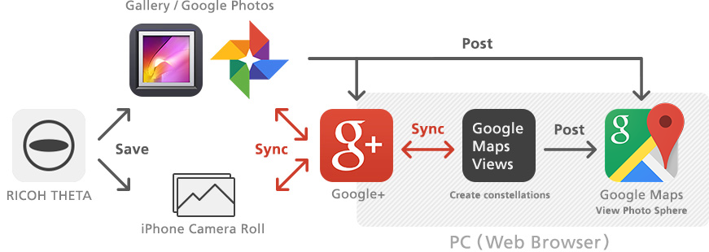

== Google Maps, Street View, Constellations, Photos
https://www.google.com/intl/en_us/maps/streetview/[Google Street View]

RICOH THETA supports
https://www.google.com/maps/about/contribute/photosphere/[Google Photo Sphere]
 XMP.
You can share and view your spherical images on Google’s service
(Gallery, Google Maps, Views, Google+, Photos).

=== Maps
You can share the place you photographed with RICOH THETA
by posting your spherical images on Google Maps. You can post your
spherical images using your Android phone or on your
PC with the Google Maps Views website. Share your images with
the entire world!

image::img/google_img_02.jpg[]

=== Constellations
You can create your own Street View using spherical images and share it with the world.
 Simply add some images to Views and, using your PC’s web browser, link them together into a constellation. On Google Maps, spherical images will then be connected together just like in Street View.

https://support.google.com/maps/answer/3481809?hl=en&ref_topic=3189543

=== Google+ and Google Photos

You can share your spherical images with your friends by posting them to Google+.
 Spherical images posted to Google+ can be rotated and viewed using this app on an Android phone. Also, when you save your spherical images on your smart phone, they will be synced with Google Photos using Auto Backup, making it easy to see them on Google+.
