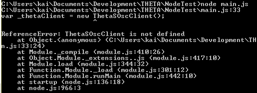

== JavaScript

Normally, JavaScript within a web browser will not be able to access the
THETA due to security restrictions. However, Node.js is able to communicate
with the camera, so that’s what I recommend using.

In addition to server-side applications,
people have successfully built applications using Cordova and
Titanium. At the DeveloperWeek Hackathon, Thuong Ho showed a nice
example using
http://ionicframework.com/[Ionic]
and
http://browserify.org/[Browserify].
Browserify lets you require('modules') in the browser by bundling
up all of your dependencies. He used Ionic to get the
https://angularjs.org/[AngularJS] components in his mobile application and
was able to take a picture and download the code using the Node.js example code
below.

WARNING: Running JavaScript in a browser directly will result in an error when you access the camera. You must use something like Node.js or another way of running the code.

Let's start with the easiest example, Node.js, from the command line.

I https://nodejs.org/en/[downloaded Node.js] for Windows.
Then, I followed a
blog post by Satoru Yamada who describes
http://theta360developers.github.io/blog/javascript/2015/12/17/theta-s-nodejs.html[how to
access the THETA camera with JavaScript].
After copying and pasting his code into a text editor,
titling the program `main.js` and running it using the
`node` command prompt” I ran into a problem with the `osc-client`.

This was simply remedied by downloading the
https://www.npmjs.com/package/osc-client[`osc-client`] using NPM.

  npm install osc-client --save

IMPORTANT: Use --save

After installing `osc-client`, I tried running the program at
the command prompt again.

IMPORTANT: Connect to the camera over WiFi first

  var fs = require('fs');
  var OscClientClass = require('osc-client').OscClient;

  var domain = '192.168.1.1';
  var port = '80';
  var client = new OscClientClass(domain, port);
  var sessionId;
  var filename;

  client.startSession().then(function(res){
    sessionId = res.body.results.sessionId;
    return client.takePicture(sessionId);
    })

  .then(function (res) {
    var pictureUri = res.body.results.fileUri;
    console.log('pictureUri :%s',pictureUri);

    var path = pictureUri.split('/');
    filename = path.pop();
    return client.getImage(pictureUri);
  })
  .then(function(res){
    var imgData = res.body;
    fs.writeFile(filename,imgData);
    return client.closeSession(sessionId);
  });

If everything goes well then the program will tell the camera to
take a picture, then save the newly created picture in the directory where
you executed the command. The file is immediately transferred to the computer.

NOTE: Organzing a [github repository of JavaScript API examples](https://github.com/theta360developers/javascript-api-samples)

If you want to take videos there is an additional package that needs to be
installed. A community member has created an add on to the osc-client
called https://www.npmjs.com/package/osc-client-theta_s[osc-client-theta_s]
that allows video capture and download. His code is included in the same link.

I ran into a series of problems with his code. First I had to download a
series of modules (superagent, debug, qs, osc-client-theta_s)
using NPM (which can be found by simply typing in the “find packages”
  search bar). Then `ThetaSOscClient` returned as undefined.

Even if you use the
https://gitlab.com/horihiro/osc-client-theta_s/tree/master[entire code sample for osc-client-theta_s that is available on GitLab],
you will see this error.

https://github.com/natelevine[Nate Levine] got the node
module working at the DeveloperWeek Hackathon where he was
able to successfully take a video using the osc-client-theta_s module and
download it to his local computer. He mentioned that the example code
from horihori doesn't work. However, the module does work and his team
won the THETA API hackathon prize at the hackathon. They took 2nd place
overall out of 120 teams.

Here's a code snippet portion related to 360 video download using
node and the THETA S API. This is from Nate's award-winning code. :-)

  var fs = require('fs');
  var ThetaSOscClient = require('osc-client-theta_s').ThetaSOscClient;

  var domain = '192.168.1.1';
  var port = '80';
  var thetaClient = new ThetaSOscClient(domain, port);
  var sessionId;
  var fileName;

  thetaClient.startSession().then(function (res) {
    //Grab the session id
    sessionId = res.body.results.sessionId;
    return thetaClient.setOptions(sessionId, {captureMode:"_video"})
  })
  .then(function (res) {
    console.log('starting capture');
    return thetaClient.startCapture(sessionId);
  })
  .catch(function (error) {
    console.log(error);
  });

  // Stop capturing after a certain interval in ms
  var interval = 5000;

  setTimeout(function () {
    console.log('stopping capture');
    thetaClient.stopCapture(sessionId)
    .then(function (res) {
      console.log('stopped capture, writing file');
      return thetaClient.listAll({entryCount:1, sort:"newest"});
    })
    // Get the filename and most recently recorded video uri
    .then(function (res) {
      fileName = res.body.results.entries[0].name;
      console.log(fileName);
      return thetaClient.getVideo(res.body.results.entries[0].uri, "full");
    })
    // Write to disk
    .then(function (res) {
      fs.writeFile(fileName, res.body);
    })
    .then(function (err) {
      console.log('closing the session');
      return thetaClient.closeSession(sessionId);
    })
    .catch(function (error) {
      console.log(error);
    });
  }, interval);
