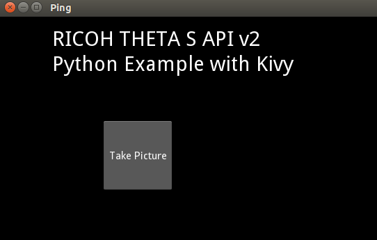

== Kivy Example

http://kivy.org/#home[Kivy] is a popular Python library similar to Pygame.
It has support for Linux, Windows, OS X, Android and iOS.  The biggest
advantage over Pygame is multitouch support. The buttons and other widgets
also look nicer. Though, in this example, I haven't used those nice
features.

Kivy uses both a Python file as well as a Kivy design language file.
Syntax highlighting and auto-completion work with both the Python libraries
and the Kivy design language using the information
https://github.com/kivy/kivy/wiki/Setting-Up-Kivy-with-various-popular-IDE's[here].

On Linux, I followed these instructions to get syntax and auto-completion
to work with PyCharm.

To install:

* Download this file https://github.com/Zen-CODE/kivybits/blob/master/IDE/PyCharm_kv_completion.jar?raw=true
* On PyCharm’s main menu, click "File"-> "Import" (or Import Settings)
* Select this file and PyCharm will present a dialog with filetypes ticked. Click OK.
* You are done. Restart PyCharm.

Here is a minimal example, using the same command line program used in the
previous example with Pygame.

=== Full program listing of `main.py`

  from kivy.app import App
  from kivy.uix.widget import Widget
  from kivy.uix.button import Button
  from thetaPythonTest import startSession, takePicture

  class takePictureBtn(Button):
      def on_press(self):
          print("Take Picture button pressed")
          sid = startSession()
          takePicture(sid)

  class Ping(Widget):
       pass

  class PingApp(App):
      def build(self):
          return Ping()

  PingApp().run()

=== `ping.kv` Full Listing

  #:kivy 1.9

  <Ping>:
      Label:
          font_size: 30
          text: "RICOH THETA S API v2 \nPython Example with Kivy"
          pos: 200, root.top - 100

      takePictureBtn:
          text: "Take Picture"
          pos: 150, root.top - 250
