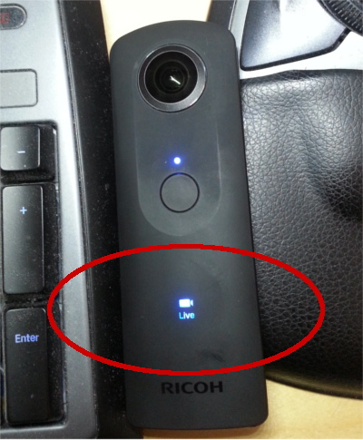
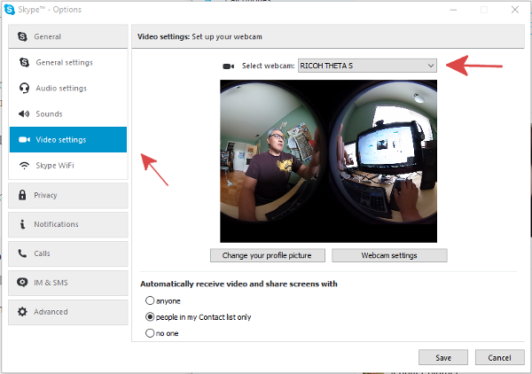
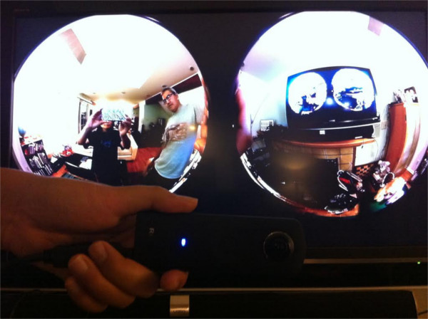

== Live Streaming

Currently the S can stream only “dual fisheye” movie, not stitched movie.
In the future,
RICOH will provide real-time stitching software as an
USB driver for laptops and also API.

=== For USB

. Press “mode button” - keep pressing - and press “power button” -> camera goes to the LiveVideoStreamig mode.
.  Connect a usb cable with S and laptop (MAC or PC).
. The THETA S can be used as a web cam. You can use web cam software such as
Skype to see live video streaming with the THETA S.

=== For HDMI

. Press “mode button” - keep pressing - and press “power button” -> camera goes to LiveVideoStreamig mode.
. connect a hdmi cable with S and a monitor.
. S could be a output video device. The monitor shows the S’s live video streaming .

[[img-hdmi_live_streaming]]

