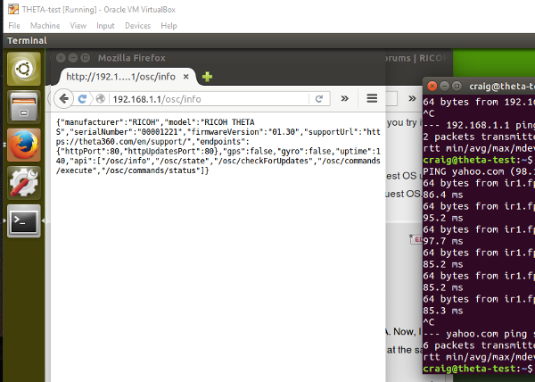

== Network
If you're connected to the THETA with WiFi, how do you
connect to the Internet at the same time?

=== Desktop and Development Environment
You need to have a separate
network card for Internet access. The most common scenario is to connect
your workstation to Ethernet and then put a USB WiFi adapter into a spare
USB port. I am using a cheap WiFi adapter that I got on Amazon for $10. I
originally bought it for my Raspberry Pi, but it works great on
Windows 10 and the connection to the THETA is solid. I have the WiFi
adapter less than a foot from my THETA for testing.

From the Windows 10 machine, I can connect to both the THETA and the
Internet. If I power the THETA from a 1.5A power source such as a
portable battery or wall socket, I can test the THETA for long periods.

As I normally work within a Linux VirtualBox VM running on a Windows 10
host, I set the VirtualBox Network Adapter with a single NAT adapter. With this
configuration, I can access both the Internet and the THETA
from within the guest VM.

=== Mobile Phone
You need to manually change the WiFi connection. If you're using
Android, we've heard that you can use your application to
change the WiFi connection from the phone to the Internet. Here's a discussion
on
http://stackoverflow.com/questions/8818290/how-to-connect-to-a-specific-wifi-network-in-android-programmatically[StackOverflow]
about this. I have not tried to implement anything myself. If you build
an application that switches the WiFi connection from the THETA to the
Internet, send me a code snippet and I'll put it in our repository.
