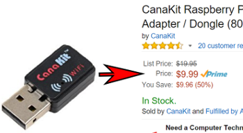
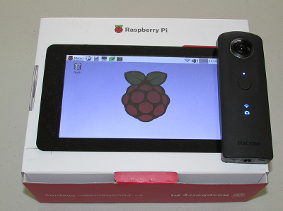
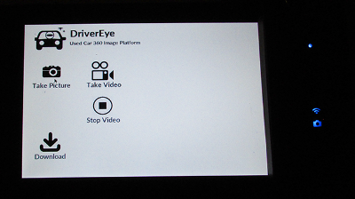

== Network
If you're connected to the THETA with WiFi, how do you
connect to the Internet at the same time?

=== Desktop and Development Environment
The THETA S is always at `192.168.1.1`. You can't change the IP address.
In my primary test environment, my Internet router from ATT is
`192.168.1.254`. Thus, I can connect to the THETA with a USB WiFi
adapter and to the Internet with Ethernet.

IMPORTANT: If your WiFi router is at 192.168.1.1, then you will need to change it.

If you don't know the IP address of your gateway, you can use `ipconfig`
on Windows or `ifconfig` on Linux.

This is what I see on Windows:

  C:\Users\Craig>ipconfig
  Windows IP Configuration
  Ethernet adapter Ethernet:
     Connection-specific DNS Suffix  . : attlocal.net
     IPv4 Address. . . . . . . . . . . : 192.168.1.64
     Subnet Mask . . . . . . . . . . . : 255.255.255.0
     Default Gateway . . . . . . . . . : 192.168.1.254

I actually have more IPv6 info, but as we're not using IPv6 addresses
in this example, I just included the IPv4 (192.x.x.x) information.

On Windows, the connection from the desktop Windows machine to the
THETA looks like this:

  Wireless LAN adapter Wi-Fi:
     Connection-specific DNS Suffix  . :
     IPv4 Address. . . . . . . . . . . : 192.168.1.5
     Subnet Mask . . . . . . . . . . . : 255.255.255.0
     Default Gateway . . . . . . . . . : 192.168.1.1

I am using a cheap WiFi adapter that I got on Amazon for $10. I
originally bought it for my Raspberry Pi, but it works great on
Windows 10 and the connection to the THETA is solid. I have the WiFi
adapter less than a foot from my THETA for testing. There are many WiFi
adapters at the $10 price point. If you're going
to develop apps for the THETA, it's a good investment.

From the Windows 10 machine, I can connect to both the THETA and the
Internet. If I power the THETA from a 1.5A power source such as a
portable battery or wall socket, I can test the THETA for long periods.

As I normally work within a Linux VirtualBox VM running on a Windows 10
host, I set the VirtualBox Network Adapter with a single NAT adapter. With this
configuration, I can access both the Internet and the THETA
from within the guest VM.

image::img/tools/dev_environment.png[role="thumb" title="Accessing the THETA and Internet Simultaneously"]

Inside of the Linux VM, I am getting good Internet access to GitHub over the
Internet and to the THETA, which I can test using `curl`.

  ricoh@odapolis: $ ping theta360developers.github.io
  PING github.map.fastly.net (185.31.19.133) 56(84) bytes of data.
  64 bytes from 185.31.19.133: icmp_seq=1 ttl=52 time=161 ms
  64 bytes from 185.31.19.133: icmp_seq=2 ttl=52 time=161 ms
  ^C
  --- github.map.fastly.net ping statistics ---
  2 packets transmitted, 2 received, 0% packet loss, time 1001ms
  rtt min/avg/max/mdev = 161.515/161.688/161.862/0.437 ms

  ricoh@odapolis: $ curl http://192.168.1.1/osc/info
  {"manufacturer":"RICOH","model":"RICOH THETA S","serialNumber":"00001221",
  "firmwareVersion":"01.30",
  "supportUrl":"https://theta360.com/en/support/",
  "endpoints":{"httpPort":80,"httpUpdatesPort":80},
  "gps":false,"gyro":false,"uptime":226,
  "api":["/osc/info",
  "/osc/state",
  "/osc/checkForUpdates",
  "/osc/commands/execute",
  "/osc/commands/status"]}

=== Mobile Phone
You need to manually change the WiFi connection. If you're using
Android, we've heard that you can use your application to
change the WiFi connection from the phone to the Internet. Here's a discussion
on
http://stackoverflow.com/questions/8818290/how-to-connect-to-a-specific-wifi-network-in-android-programmatically[StackOverflow]
about this. I have not tried to implement anything myself. If you build
an application that switches the WiFi connection from the THETA to the
Internet, send me a code snippet and I'll put it in our repository.

=== Raspberry Pi and Windows Tablet
If you'd like to build a standalone hardware device to give to real estate
agents or used car marketers, you can put two Wifi adapters on Raspberry Pi
or plug a WiFi adapter into the USB port of your tablet.

This is a picture of a self-contained Raspberry Pi unit powered by a
rechargeable battery.

image::img/rpi/rpi_box.png[role="thumb" title="Prototype used car marketing unit with dual WiFi and battery power"]

The Raspberry Pi is completely portable and can connect to the Internet and the
THETA at the same time. The interface is a touchscreen.

This is an updated version of the system with a
RPi touch interface built with Pygame.

