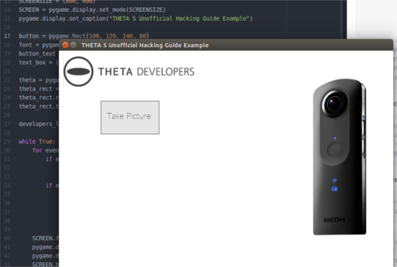

== Python Desktop Application Example

This example uses the same Python code from the previous command line
example and runs it from a GUI.  The example uses http://www.pygame.org/download.shtml[Pygame]
due to the ease with which a GUI can be built. The application can
also be https://github.com/renpytom/rapt-pygame-example[modified to run on Android phones].
The source code is available on https://github.com/codetricity/theta-s-api-tests[GitHub].

Modify the code in the previous example to allow running as a library.

  if __name__ == '__main__':
      main()

The previous code is called `thetaPythonTest.py` and is in the same directory
as my new program.  The full program has two graphics purely for decoration.
You don't need those portions and can ignore them.

IMPORTANT: I've changed the library name to thetapylib.py, but I have not updated
the code example below.  Suggest you look at pyTHETA.py command line tool.
The older test library thetaPythonTest.py should still be there and work.
deskTHETA.py now has more examples to start and stop video capture.  I'll
try and get some of the file listing and transfer commands working with the
GUI prior to the Hackathon, but we're in crunch time.

=== Full Program
  import pygame, sys
  import requests
  import json
  from thetaPythonTest import startSession, takePicture

  WHITE = (255,255,255)
  GRAY = (230, 230, 230)
  GREEN = (100, 200, 50)
  DARK = (64, 64, 64)

  pygame.init()
  SCREENSIZE = (800, 600)
  SCREEN = pygame.display.set_mode(SCREENSIZE)

  button = pygame.Rect(100, 120, 140, 80)
  font = pygame.font.Font("fnt/Lato-Thin.ttf", 20)
  button_text = font.render("Take Picture", True, DARK)
  text_box = (button.left + 15, button.top + 23)

  theta = pygame.image.load("img/ricoh-theta-s.png")
  theta_rect = theta.get_rect()
  theta_rect.right = SCREENSIZE[0] - 50
  theta_rect.top = 60

  developers_logo = pygame.image.load("img/theta_developers.png")

  while True:
      for event in pygame.event.get():
          if event.type == pygame.QUIT:
              pygame.quit()
              sys.exit()
          if event.type == pygame.MOUSEBUTTONDOWN:
              mouse_pos = pygame.mouse.get_pos()
              if button.collidepoint(mouse_pos):
                  sid = startSession()
                  takePicture(sid)

      SCREEN.fill(WHITE)
      pygame.draw.rect(SCREEN,GRAY, button)
      pygame.draw.rect(SCREEN, DARK, button, 1)
      SCREEN.blit(button_text, text_box)
      SCREEN.blit(theta, theta_rect)
      SCREEN.blit(developers_logo, (10, 10))

      pygame.display.update()

=== Code Walkthrough

Import the `pygame` and `sys` libraries and set up a blank window.

  import pygame, sys

  pygame.init()
  SCREENSIZE = (800, 600)
  SCREEN = pygame.display.set_mode(SCREENSIZE)

  while True:
      for event in pygame.event.get():
          if event.type == pygame.QUIT:
              pygame.quit()
              sys.exit()
      pygame.display.update()

Load your fonts and colors above the main `while` loop.

  WHITE = (255,255,255)
  GRAY = (230, 230, 230)
  GREEN = (100, 200, 50)
  DARK = (64, 64, 64)
  font = pygame.font.Font("fnt/Lato-Thin.ttf", 20)

Build the button to press to take a picture.  This code also goes above
the main `while` loop.

  button = pygame.Rect(100, 120, 140, 80)
  button_text = font.render("Take Picture", True, DARK)
  text_box = (button.left + 15, button.top + 23)

Import your previous functions, close to the top of your program.

  from thetaPythonTest import startSession, takePicture

Draw the button inside of the main `while` loop above the `display.update`
statement.

  SCREEN.fill(WHITE)
  pygame.draw.rect(SCREEN,GRAY, button)
  pygame.draw.rect(SCREEN, DARK, button, 1)
  SCREEN.blit(button_text, text_box)

In the event queue loop, check for a button press. If there is a button
press, then start a new camera session and take the picture. The button press is
detected by first checking for an event `MOUSEBUTTONDOWN`.  If the mouse or
touchscreen is down, then get the position of the mouse or finger. If the
point of the mouse is inside of the button, then take the picture.

  if event.type == pygame.MOUSEBUTTONDOWN:
      mouse_pos = pygame.mouse.get_pos()
      if button.collidepoint(mouse_pos):
          sid = startSession()
          takePicture(sid)
