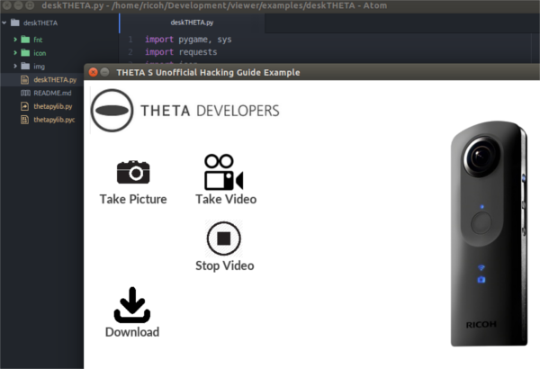

= API Guide - How to Use the THETA S API Community Guide (Guide 1 of 3)
:icons: font
:toc:
The RICOH THETA Developer Community

== Unofficial and Unauthorized
This is an unofficial, community-generated guide to using the RICOH THETA S API.
This is not authorized by RICOH and is based on publicly available information.

== RICOH THETA Developer Community Guide and Other Resources
We are in the process of dividing the guide into two sections:

1. http://codetricity.github.io/theta-s/index.html[API Usage] (This Guide)
2. http://theta360developers.github.io/community-document/community.html[360 Media] Live Streaming of 360 videos, 360 image display.
3. Usage - planned. Does not exist as of Dec, 2015

== Connect Computer to THETA S
Turn on the THETA S.  The WiFi icon will flash blue.

On your computer connect to the THETA access point that the camera
created.

image::img/wifi_access.png[]

On Windows 10, the network can be changed from the connection
icon in the lower right-hand corner.  If you are using WiFi for
Internet access, you will lose Internet access.  The camera
is at IP `192.168.1.1`.  This subnet may interfere with your
network access even if you have multiple network adapters.  If this happens
and you can't reach the THETA, disable all other network adapters.

On Windows 10, running `ipconfig` will show your configured network
adapters.

image::img/ipconfig_network_adapters.png[]

Your Wireless LAN must be in the subnet `192.168.1.x`.  The Default Gateway
must be `192.168.1.1`.  The gateway is the THETA S.

After establishing a wifi connection, please open a browser and access:

  http://192.168.1.1/osc/info

The response:

  {"manufacture":"RICOH",
    "model":"RICOH THETA S",
    "serialNumber":"00001054",
    "firmwareVersion":"01.00",
    "supportUrl":"https://theta360.com/en/support/",
    "endpoints":{
      ... THERE WILL BE MORE INFO

== Test Commands From Computer to Camera
You can use any tool to test `POST` and `GET` commands to the camera.
Many people use
link:http://curl.haxx.se/[curl], a web browser, or
link:https://www.getpostman.com/[Postman].  In this example, I
am using
link:https://chrome.google.com/webstore/detail/dhc-resthttp-api-client/aejoelaoggembcahagimdiliamlcdmfm?hl=en[DHC by Restlet].
It is available for free as a Chrome Extension.

image::img/tools/dhc_client.png[]

`POST` to `http://192.168.1.1/osc/commands/execute`

image::img/http_request.png[]

image::img/post.png[]

image::img/start_session.png[]

Results:

  {
    "name": "camera.startSession",
    "state": "done",
    "results":{
      "sessionId": "SID_0001",
      "timeout": 180
    }
  }

Send a `POST` command to `/osc/state`.

  {
    "fingerprint": "FIG_0001",
    "state":{
      "sessionId": "SID_0000",
      "batteryLevel": 1,
      "storageChanged": false,
      "_captureStatus": "idle",
      "_recordedTime": 0,
      "_recordableTime": 0,
      "_latestFileUri": "",
      "_batteryState": "charged"
    }
  }

TIP: I have the camera plugged into a standalone charger capable supplying
1.5 amps.  The camera won't charge when plugged into the USB port
of most computers.

Read the
link:https://developers.theta360.com/en/docs/v2/api_reference/[API Reference on the RICOH]
site.

include::take_picture.adoc[]

== Testing Workflow Using a HTTP Browser Tool

TIP: For quick testing, save the individual commands into your testing tool.

In this example, I've saved it into
link:http://restlet.com/products/dhc/[DHC by Restlet].

image::img/tools/dhc_workflow.png[]

With this type of tool, you can quickly test indvidual commands and see the
results prior to running your program or test script.

NOTE: I have not been able to get a mock server running that supports the full
RICOH THETA API v2.  In my tests, I needed to connect to the actual device.  If you
build a functional mock server, send it to me. :-)

include::python_tests.adoc[]

include::python_desktop.adoc[]

////
include::kivy_example.adoc[]
////

include::transfer.adoc[]

/*include::live_streaming.adoc[]*/

/*include::video_conversion.adoc[]*/

include::google.adoc[]

include::rpi.adoc[]

include::resources.adoc[]

include::hackathon_tips.adoc[]

include::thetapylib.adoc[]

include::nextsteps.adoc[]
