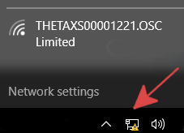
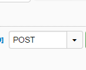
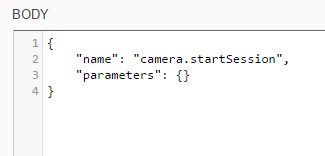

= http://theta360developers.github.io/[Unofficial Guides]
:icons: font
:toc: right
:toclevels: 1
:toc-title: Contents
:sectnums:
:source-highlighter: coderay

++++

++++

http://lists.theta360.guide/c/theta-api-usage[Discuss, comment, and ask questions].
You can also log in and send a private message to  http://lists.theta360.guide/users/jcasman/[jcasman].

This is an unofficial, community-generated guide to using the RICOH THETA S API.
This is not authorized by RICOH and is based on publicly available information.

WARNING: THETA https://developers.theta360.com/en/docs/v2.1/api_reference/[API v2.1] was recently released. This guide
focuses on https://developers.theta360.com/en/docs/v2.0/api_reference/[API v2.0]. There are
http://lists.theta360.guide/t/new-theta-api-version-2-1/202[significant differences]. I will
update this guide for API v2.1. In the meantime, v2.0 still works.

== Quickstart

=== Connect Computer to THETA S
Turn on the THETA S.  The WiFi icon will flash blue.

On your computer connect to the THETA access point that the camera
created. The password is the serial number

On Windows 10, the network can be changed from the connection
icon in the lower right-hand corner.  If you are using WiFi for
Internet access, you will lose Internet access.  The camera
is at IP `192.168.1.1`.  This subnet may interfere with your
network access even if you have multiple network adapters.  If this happens
and you can't reach the THETA, disable all other network adapters.

On Windows 10, running `ipconfig` will show your configured network
adapters.

image::img/ipconfig_network_adapters.png[]

Your Wireless LAN must be in the subnet `192.168.1.x`.  The Default Gateway
must be `192.168.1.1`.  The gateway is the THETA S.

After establishing a wifi connection, please open a browser and access:

  http://192.168.1.1/osc/info

The response:

[source, javascript]
----
  {"manufacture":"RICOH",
    "model":"RICOH THETA S",
    "serialNumber":"00001054",
    "firmwareVersion":"01.00",
    "supportUrl":"https://theta360.com/en/support/",
    "endpoints":{
      ... THERE WILL BE MORE INFO
----

=== Test Commands From Computer to Camera
You can use any HTTP tool to test `POST` and `GET` commands to the camera.
Many people use
link:http://curl.haxx.se/[curl], a web browser, or
link:https://www.getpostman.com/[Postman].  In this example, I
am using
link:https://chrome.google.com/webstore/detail/dhc-resthttp-api-client/aejoelaoggembcahagimdiliamlcdmfm?hl=en[DHC by Restlet].
It is available for free as a Chrome Extension.

==== Using DHC - Free HTTP Testing Tool

After you install DHC as a Chrome Extension, set up a new post command as shown below.

`POST` to `http://192.168.1.1/osc/commands/execute`

image::img/http_request.png[]

Results:

[source, javascript]
----
  {
    "name": "camera.startSession",
    "state": "done",
    "results":{
      "sessionId": "SID_0001",
      "timeout": 180
    }
  }
----

Send a `POST` command to `/osc/state`.

[source, javascript]
----
  {
    "fingerprint": "FIG_0001",
    "state":{
      "sessionId": "SID_0000",
      "batteryLevel": 1,
      "storageChanged": false,
      "_captureStatus": "idle",
      "_recordedTime": 0,
      "_recordableTime": 0,
      "_latestFileUri": "",
      "_batteryState": "charged"
    }
  }
----

TIP: I have the camera plugged into a standalone charger capable supplying
1.5 amps.  The camera won't connect with WiFi when plugged into the USB port
of most computers.

include::take_picture.adoc[]

=== Save Tests With a HTTP Browser Tool

TIP: For easier testing, save the individual commands into your testing tool.

In this example, I've saved it into
link:http://restlet.com/products/dhc/[DHC by Restlet].

image::img/tools/dhc_workflow.png[]

With this type of free tool, you can quickly test individual commands and see the
results prior to running your program or test script. If you create a free account
with DHC, you can save the commands in the cloud and run your tests from any
Chrome browser on any computer.

== Basic Apps

I used Python and JavaScript with node to test the API.
If you use JavaScript, browser code can't access the camera directly
due to security restrictions.

include::python_tests.adoc[]

include::javascript.adoc[]

include::otherLang.adoc[]

== Small Hardware WiFi Control

include::rpi.adoc[]

include::hardware.adoc[]

include::usb.adoc[]

include::tips.adoc[]

==  Resources
=== Official Information

* https://developers.theta360.com/en/docs/v2/api_reference/[RICOH THETA API v2.1],
* https://developers.theta360.com/en/forums/[THETA Developers Official Forum]
* https://developers.theta360.com/en/docs/sdk/[Official SDK]
* https://theta360.com/en/support/download/[Windows, Mac, iOS, Android apps]

=== Unofficial Information
// * https://github.com/theta360developers[GitHub listing of community repositories] - libraries and code examples from the community
* http://theta360.guide/[THETA Unofficial Guide] - Articles, guides, and tutorials from the community

== Appendix
include::python_desktop.adoc[]

include::thetapylib.adoc[]

include::transfer.adoc[]
