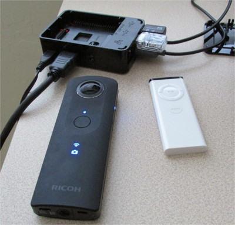
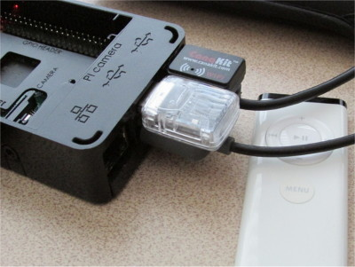
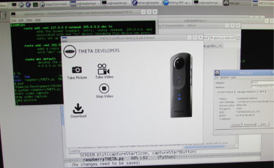

== Raspberry Pi

The Raspberry Pi works great with the RICOH THETA S API over WiFi.
In this example, I have it working with the
https://flirc.tv/[FLIRC] USB dongle to connect a simple IR remote
to THETA S.

This examples opens up a range of possibilities for triggering
pictures and video with motion, light, and other sensors connected
to the Raspberry Pi.

Although the picture shows USB and an HDMI cable connected to the
Raspberry Pi, you can remove the cables and connect the
Raspberry Pi to a http://www.adafruit.com/products/1566[battery]. The
one in the link powered an Pi for 15 hours.

I have only tested the Pi with the remote control as a proof of concept
to make sure it works. I tested taking a picture, starting a video, and
stopping a video capture.  The modifications only took 15 minutes,
most of this time was spent fiddling with my WiFi routes since it was
the first time I connected the Pi to the THETA S.

I have the same GUI displayed from my deskTHETA example.  However,
you don't need a monitor connected to run the program.  Right now,
the GUI serves no purpose other than testing from the Pi to the THETA.

