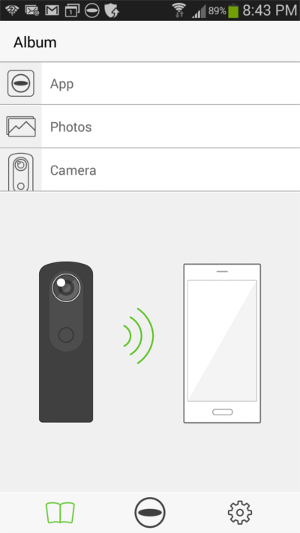
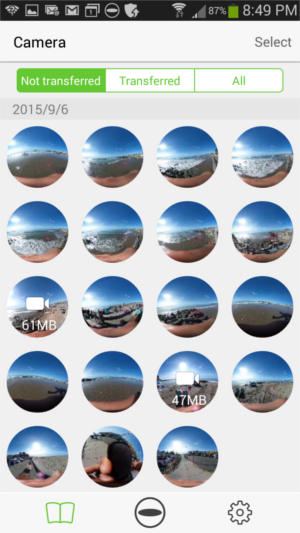

== Taking Pictures

Start the session.

  192.168.1.1/osc/commands/execute

  {
    "name": "camera.startSession",
    "parameters": {}
  }

Grab the `sessionId` and take the picture.

  {
    "name": "camera.takePicture",
    "parameters": {
    	"sessionId": "SID_0001"
    }
  }

The camera will beep.

At this point, you can grab the image with the API. However,
it will be a stream of binary data.  To convert this into
a something like a jpg that can displayed on the screen, you'll
need to get the stream, convert it, then display the image to your
screen and allow user interaction with the image.

To test whether you've saved the image and to get the great
satisfaction of seeing your image, you can also check out the
image with your phone using the THETA S app.

First disconnect your computer from the THETA S WiFi hotspot, then connect
the phone to the camera.

WARNING: The THETA S can only connect to one wireless device at a time.
You can connect your laptop or your phone, but not both at the same
time.

Select *Camera*.

Select the thumbnail.

The image can be rotated.

image::img/beach.png[]
