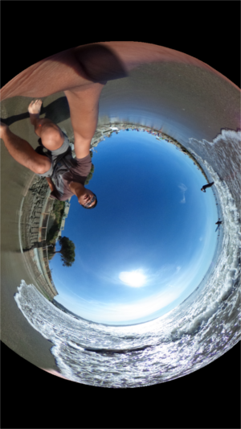

=== Taking Pictures

Start the session.

:WARNING: There are three versions of the API to control the camera.
https://developers.theta360.com/en/docs/v2.0/api_reference/[API v2.0] and
https://developers.theta360.com/en/docs/v2.1/api_reference/[API v2.1] are used with WiFi.

[source, javascript]
----
  192.168.1.1/osc/commands/execute

  {
    "name": "camera.startSession",
    "parameters": {}
  }

----

Grab the `sessionId` and take the picture.

  {
    "name": "camera.takePicture",
    "parameters": {
    	"sessionId": "SID_0001"
    }
  }

The camera will beep.

=== Downloading the Image To Your Computer

To test whether you've saved the image and to get the great
satisfaction of seeing your image, you can grab the image with the API or with
the mobile app.

If you use the API, the image is returned as a binary stream. Depending on
your application or testing tool, you may need to convert it into a file.
In DHC, the binary stream image is automatically
converted into a viewable JPEG.

The first step to download the image is to get the image URI.

Use the `camera._listAll` command to see a listing of files with the URI.

CAUTION: There are two OSC (WiFi) API versions, v2.0 and v2.1.
The `_listAll` command in v2.0 is being replaced with `listFiles`.
I have not managed to get `listFiles` to work yet.

  {
      "name": "camera._listAll",
      "parameters": {
      	"entryCount": 3
      }
  }

Use the URI in the POST parameters for `getImage`. In this example, the URI is
`100RICOH/R0011788.JPG`.

image::img/tools/getimagePost.png[]

You will see the equirectangular image in the response.

If you want to see the image with navigation, open the
image with your phone using the THETA S app.

First disconnect your computer from the THETA S WiFi hotspot, then connect
the phone to the camera.

WARNING: The THETA S can only connect to one wireless device at a time.
You can connect your laptop or your phone, but not both at the same
time.

image::img/ricoh_theta_app.png[]

Select *Camera*.

Select the thumbnail.

image::img/select.png[]

The image can be rotated.

