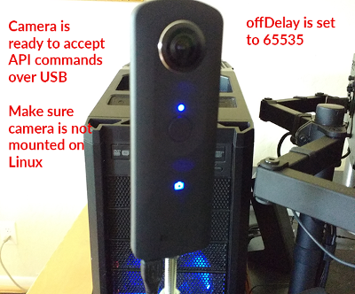
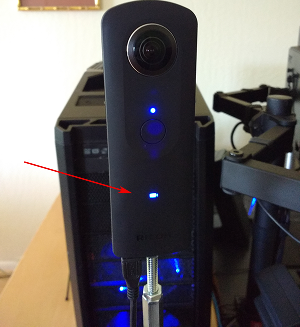
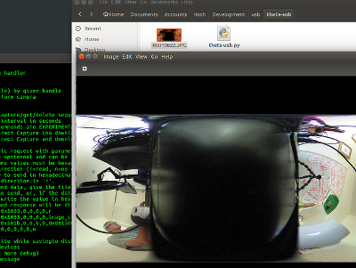
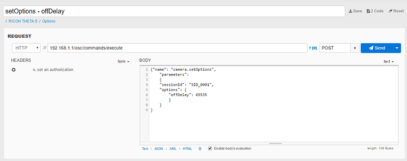
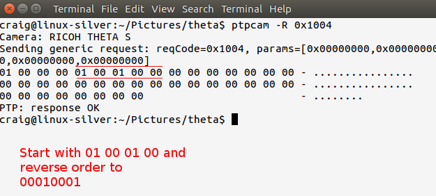
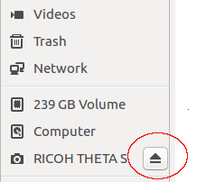

== Using the API Over USB

Developers can access the RICOH THETA API over USB.

=== Advantages of API Over USB

* The THETA can be left powered on indefinitely for applications such as surveillance,
map creation or time-lapse photography
* The files download much faster from the camera to the computer
* There are no issues with WiFi signal strength or WiFi setup

=== Disadvantages of API Over USB

* The PTP API (the USB one) is not as complete as the THETA API v2 (the WiFi one)
* There are less people using the USB API
* It's harder to work with as you need to send it hex codes, not human-readable commands
* We may find issues with the libraries for PTP access

If you choose to develop your application with the v2 USB API, you are a pioneer.
Please contribute your experiences with the community.

=== Controlling from Raspberry Pi or Linux With USB

The community initially started connecting to the THETA from Windows with
link:https://msdn.microsoft.com/en-us/library/windows/desktop/ff384848(v=vs.85).aspx[MTP Extensions]
and
Raspberry Pi devices using
link:http://libptp.sourceforge.net/[libptp]. As I am more familiar with Linux,
I ran my tests on Ubuntu 16.04. I also know that people are using the same programs on the
Raspberry Pi with Raspian OS (similar to Ubuntu or Debian).

As far as I know, the API works fine on Windows and the
link:https://msdn.microsoft.com/en-us/library/windows/desktop/ff384842(v=vs.85).aspx[examples] on the
Microsoft site work.

NOTE: In the above example, change the Op Code to 0x100e and the StorageID to 0x0

This tutorial will focus on `libptp`, which I compiled from source.
I'll document the installation of `libptp` in a future update. `libptp`
also installs `ptpcam`.

==== Preparing the Camera for USB Control

* Camera is on, there is a blue light
* Camera is connected with USB to Linux computer (camera is USB 2.0, but it'll work on a USB 3.0 port)
* Camera is not mounted

==== Verify Computer finds Camera as USB Devices

  $ lsusb
  Bus 003 Device 009: ID 05ca:0366 Ricoh Co., Ltd

==== Verify ptpcam Can Connect to Camera

First verify that ptpcam can connect to the camera.

$ ptpcam -i

  Camera information
  ==================
  Model: RICOH THETA S
    manufacturer: Ricoh Company, Ltd.
    serial number: '00010093'
    device version: 01.42
    extension ID: 0x00000006
    extension description: (null)
    extension version: 0x006e

Next, we'll list all the operations that libptp can access on the camera over usb.

  $ ptpcam -o

  Listing supported operations...
  Camera: RICOH THETA S
    0x1001: GetDeviceInfo
    0x1002: OpenSession
    0x1003: CloseSession
    0x1004: GetStorageIDs
    0x1005: GetStorageInfo
    0x1006: GetNumObjects
    0x1007: GetObjectHandles
    0x1008: GetObjectInfo
    0x1009: GetObject
    0x100a: GetThumb
    0x100b: DeleteObject
    0x1014: GetDevicePropDesc
    0x1015: GetDevicePropValue
    0x101b: GetPartialObject
    0x9001: UNKNOWN
    0x9991: UNKNOWN
    0x9999: UNKNOWN
    0x999a: UNKNOWN
    0x999b: UNKNOWN
    0x999c: UNKNOWN
    0x999d: UNKNOWN
    0x100e: InitiateCapture
    0x1016: SetDevicePropValue
    0x101c: InitiateOpenCapture
    0x1018: TerminateOpenCapture
    0x99a2: UNKNOWN

It's looking very promising. Next, we'll list the properties that can accessed.

=== Accessing Camera Properties Over USB

  $ ptpcam -p

  Listing properties...
  Camera: RICOH THETA S
    0x5001: Battery Level
    0x5002: Functional Mode
    0x5003: Image Size
    0x5011: Date Time
    0x5012: Pre-Capture Delay
    0xd407: UNKNOWN
    0x5005: White Balance
    0x500e: Exposure Program Mode
    0x500f: Exposure Index (film speed ISO)
    0x5010: Exposure Bias Compensation
    0x5013: Still Capture Mode
    0x501a: Timelapse Number
    0x501b: Timelapse Interval
    0x502c: UNKNOWN
    ....

Let's check if I have battery.

  $ ptpcam --show-property=0x5001

  Camera: RICOH THETA S
  'Battery Level' is set to: 100

It's plugged into USB, so it makes sense that my battery is at 100%.

Next, I'll check the image size:

  $ ptpcam --show-property=0x5003

  Camera: RICOH THETA S
  'Image Size' is set to: "5376x2688"

I'll check the time:

  $ ptpcam --show-property=0x5011

  Camera: RICOH THETA S
  'Date Time' is set to: "20160701T142845-0700"

Check Capture Mode

  $ ptpcam --show-property=0x5013

  Camera: RICOH THETA S
  'Still Capture Mode' is set to: [Normal]

Set Capture Mode to Video

Using the RICOH v2 USB documentation, you can find that video shooting corresponds to 0x8002.

  $ ptpcam --set-property=0x5013 --val=0x8002

  Camera: RICOH THETA S
  'Still Capture Mode' is set to: [Normal]
  Changing property value to 0x8002 [(null)] succeeded.

Verify that the change was saved:

  $ ptpcam --show-property=0x5013

  Camera: RICOH THETA S
  'Still Capture Mode' is set to: 0x8002 (-32766)

The blue light on the THETA now shows a video icon.

At this stage, I boiled a pot of tea and left the camera on. When I came back, it had turned off.

I verified that the battery was still at 100%.

  $ ptpcam --show-property=0x5013

  Camera: RICOH THETA S
  'Still Capture Mode' is set to: 0x8002 (-32766)
  craig@linux-silver:~$ ptpcam --show-property=0x5001

  Camera: RICOH THETA S
  'Battery Level' is set to: 100

I then looked at the sleepDelay

  $ ptpcam --show-property=0xd803

  Camera: RICOH THETA S
  'UNKNOWN' is set to: 600

The sleepDelay is set to 600 seconds, or 10 minutes. I'm going to disable it.

  $ ptpcam --set-property=0xd803 --val=0

  Camera: RICOH THETA S
  'UNKNOWN' is set to: 600
  Changing property value to 0 [(null)] succeeded.

Now, hopefully, the THETA will stay on indefinitely, powered by the USB and I'll be able to use it in an industrial application such as security surveillance.

List the files on your THETA.

  $ ptpcam -L

  Listing files...
  Camera: RICOH THETA S
  Handler:           Size:     Captured:          name:
  0x0064026e:      4000851    2016-06-03 21:11    R0010622.JPG
  0x0064026f:      3953884    2016-06-09 22:52    R0010623.JPG
  0x00640270:      3923907    2016-06-10 00:22    R0010624.JPG

Download the first file from the camera to your local computer.

  $ ptpcam --get-file=0x0064026e
  Camera: RICOH THETA S
  Saving file: "R0010622.JPG" is done.

Boom! It's super fast.

You can look at the image in your Linux file browser just to verify that
the image was downloaded. In this picture, I have the THETA
lying on it's side on my desk.

It's not a very nice picture, so I'll delete it.

  $ ptpcam --delete-object=0x0064026e

  Object 0x0064026e (R0010622.JPG) deleted.

I'm going to take another shot with my camera in a tripod. First, I'll set the
mode to still image as I set it to video earlier.

  $ ptpcam --set-property=0x5013 --val=0x0001

  Camera: RICOH THETA S
  'Still Capture Mode' is set to: 0x8002 (-32766)
  Changing property value to 0x0001 [(null)] succeeded.

Then, I take the image.

  $ ptpcam -c

  Initiating captue...

List the files on the camera:

  $ ptpcam -L

  Listing files...
  Camera: RICOH THETA S
  Handler:           Size:     Captured:          name:
  ....
  0x0064027e:      3930938    2016-07-01 23:22    R0010638.JPG

Download the file to my local computer

  $ ptpcam --get-file=0x0064027e
  Camera: RICOH THETA S
  Saving file: "R0010638.JPG" is done.

Verify that the download worked.

image::img/usb/sample.jpg[role="thumb" title="Sample Image of My Rig Downloaded with USB API"]

You can now see my boss Antec case for my overclocked system and the top of
my overclocked and watercooled Linux test rig decorated with
rainbow tape by my daughter.

I then checked the battery to verify that the THETA can last indefinitely connected with USB:

  $ ptpcam --show-property=0x5001

  Camera: RICOH THETA S
  'Battery Level' is set to: 100

Wait! The camera just turned off. I'm going to connect with the WiFi USB to set the offDelay.

TIP: I have two network interfaces in my computer, I can access the THETA over WiFi while I am connected to the Internet.

TIP: I use DHC to easily set the options. DHC is a tool to send, save, and organize HTTP requests. As I test the THETA frequently.

If the image is difficult to see, the relevant POST body is

  {"name": "camera.setOptions",
      "parameters":
  	{
      "sessionId": "SID_0001",
      "options": {
  		"offDelay": 65535
      	}
  	}
  }

You can check the offDelay parameter with this:

  {"name": "camera.getOptions",
      "parameters":
  	{
      	"sessionId": "SID_0001",
      	"optionNames": [
              "offDelay"
      	]
  	}
  }

Again, I have this template saved in DHC, so it's easy for me to just change the optionNames.

I'm hopeful that the THETA will now stay on forever. At this point, it's been on for
several hours and I can send it API commands.
So, it's in a good state for surveillance or mapping. I think I can leave it on
for days. I just checked the battery again after leaving the camera on for
hours.

  $ ptpcam --show-property=5001

  Camera: RICOH THETA S
  'Battery Level' is set to: 100

Bring on the industrial applications!

=== Using Raw PTP Commands

Your program may have to use raw PTP commands. It's almost the same as
the examples above. I'll include some examples using raw PTP.

==== Grabbing Info

Pass the raw PTP command of `GetDeviceInfo` as a hex string, `0x1001`

  craig@linux-silver:$ ptpcam -R 0x1001
  Camera: RICOH THETA S
  Sending generic request: reqCode=0x1001, params=[0x00000000,0x00000000,0x00000000,0x00000000,0x00000000]
  64 00 06 00 00 00 6e 00 00 01 80 1a 00 00 00 01 - d.....n.........
  10 02 10 03 10 04 10 05 10 06 10 07 10 08 10 09 - ................
  10 0a 10 0b 10 14 10 15 10 1b 10 01 90 91 99 99 - ................
  99 9a 99 9b 99 9c 99 9d 99 0e 10 16 10 1c 10 18 - ................
  10 a2 99 06 00 00 00 02 40 06 40 08 40 0a 40 0c - ........@.@.@.@.
  40 0d 40 1d 00 00 00 01 50 02 50 03 50 11 50 12 - @.@.....P.P.P.P.
  50 07 d4 05 50 0e 50 0f 50 10 50 13 50 1a 50 1b - P...P.P.P.P.P.P.
  50 2c 50 06 d0 0f d0 01 d8 02 d8 03 d8 05 d8 06 - P,P.............
  d8 07 d8 08 d8 09 d8 0a d8 0b d8 0c d8 0d d8 0e - ................
  d8 00 00 00 00 04 00 00 00 01 30 01 38 02 b8 82 - ..........0.8...
  b9 14 52 00 69 00 63 00 6f 00 68 00 20 00 43 00 - ..R.i.c.o.h. .C.
  6f 00 6d 00 70 00 61 00 6e 00 79 00 2c 00 20 00 - o.m.p.a.n.y.,. .
  4c 00 74 00 64 00 2e 00 00 00 0e 52 00 49 00 43 - L.t.d......R.I.C
  00 4f 00 48 00 20 00 54 00 48 00 45 00 54 00 41 - .O.H. .T.H.E.T.A
  00 20 00 53 00 00 00 06 30 00 31 00 2e 00 34 00 - . .S....0.1...4.
  32 00 00 00 09 30 00 30 00 30 00 31 00 30 00 30 - 2....0.0.0.1.0.0
  00 39 00 33 00 00 00 00                         - .9.3....
  PTP: response OK

==== Checking Battery Status

`0x1015` is `GetDevicePropValue`. The property battery is `0x5001`.
The result is a number between 0 and 100. I get 64 in hex which corresponds
to a decimal value of 100. My battery charge is 100%. It's connected with USB,
it's always 100% :-)

  craig@linux-silver:$ ptpcam -R 0x1015,0x5001
  Camera: RICOH THETA S
  Sending generic request: reqCode=0x1015, params=[0x00005001,0x00000000,0x00000000,0x00000000,0x00000000]
  64 00 00 00 00 00 00 00 00 00 00 00 00 00 00 00 - d...............
  00 00 00 00 00 00 00 00 00 00 00 00 00 00 00 00 - ................
  00 00 00 00 00 00 00 00                         - ........
  PTP: response OK

==== Getting Size of Still Image

In this example, I look for the property ImageSize which is 0x5003. Just to refresh from the previous example, 0x1015 is GetDevicePropValue. In the right column, you can see that the image size is 5376x2688

  craig@linux-silver:$ ptpcam -R 0x1015,0x5003
  Camera: RICOH THETA S
  Sending generic request: reqCode=0x1015, params=[0x00005003,0x00000000,0x00000000,0x00000000,0x00000000]
  0a 35 00 33 00 37 00 36 00 78 00 32 00 36 00 38 - .5.3.7.6.x.2.6.8
  00 38 00 00 00 00 00 00 00 00 00 00 00 00 00 00 - .8..............
  00 00 00 00 00 00 00 00                         - ........
  PTP: response OK

==== Taking a Picture
I can take a picture, but get a PTP: I/O error. This doesn't appear to
negatively impact taking a picture. I'll take a look at this in the futre. I think
it may relate to the delay that the THETA takes to process the image into
equirectangular format.

  $ ptpcam -R 0x100e
  Camera: RICOH THETA S
  Sending generic request: reqCode=0x100e, params=[0x00000000,0x00000000,0x00000000,0x00000000,0x00000000]
  PTP: I/O error

==== Get Storage IDs

  $ ptpcam -R 0x1004
  Camera: RICOH THETA S
  Sending generic request: reqCode=0x1004, params=[0x00000000,0x00000000,0x00000000,0x00000000,0x00000000]
  01 00 00 00 01 00 01 00 00 00 00 00 00 00 00 00 - ................
  00 00 00 00 00 00 00 00 00 00 00 00 00 00 00 00 - ................
  00 00 00 00 00 00 00 00                         - ........
  PTP: response OK

Focus on the numbers in places 5-8 and reverse the order.

==== Get Object Handles

  $ ptpcam -R 0x1007,0x00010001
  Camera: RICOH THETA S
  Sending generic request: reqCode=0x1007, params=[0x00010001,0x00000000,0x00000000,0x00000000,0x00000000]
  15 00 00 00 00 00 00 80 00 00 64 00 6f 02 64 00 - ..........d.o.d.
  70 02 64 00 71 02 64 00 72 02 64 00 73 02 64 00 - p.d.q.d.r.d.s.d.
  74 02 64 00 75 02 64 00 76 02 64 00 77 02 64 00 - t.d.u.d.v.d.w.d.
  79 02 64 00 7a 02 64 00 7b 02 64 00 7c 02 64 00 - y.d.z.d.{.d.|.d.
  7d 02 64 00 7e 02 64 00 7f 02 64 00 80 02 64 00 - }.d.~.d...d...d.
  81 02 64 00 82 02 64 00                         - ..d...d.
  PTP: response OK
  $

You'll need to reverse the order of each file handle to get information on it
or download.

==== Get File Information From Camera

  $ ptpcam -R 0x1008,0x00640282
  Camera: RICOH THETA S
  Sending generic request: reqCode=0x1008, params=[0x00640282,0x00000000,0x00000000,0x00000000,0x00000000]
  01 00 01 00 01 38 00 00 76 1f 3c 00 08 38 72 0d - .....8..v.<..8r.
  00 00 a0 00 00 00 78 00 00 00 00 15 00 00 80 0a - ......x.........
  00 00 08 00 00 00 00 00 64 00 00 00 00 00 00 00 - ........d.......
  00 00 00 00 0d 52 00 30 00 30 00 31 00 30 00 36 - .....R.0.0.1.0.6
  00 34 00 32 00 2e 00 4a 00 50 00 47 00 00 00 10 - .4.2...J.P.G....
  32 00 30 00 31 00 36 00 30 00 37 00 30 00 32 00 - 2.0.1.6.0.7.0.2.
  54 00 30 00 37 00 30 00 38 00 33 00 33 00 00 00 - T.0.7.0.8.3.3...
  10 32 00 30 00 31 00 36 00 30 00 37 00 30 00 32 - .2.0.1.6.0.7.0.2
  00 54 00 30 00 37 00 30 00 38 00 33 00 33 00 00 - .T.0.7.0.8.3.3..
  00 01 00 00 00 00 00 00                         - ........
  PTP: response OK

==== Download File as Hexdump For Testing

File contents below have been edited so you can see the beginning and end
of the file.

  $ ptpcam -R 0x1009,0x00640282 > hexdump
  $ less hexdump
  Camera: RICOH THETA S
  Sending generic request: reqCode=0x1009, params=[0x00640282,0x00000000,0x00000000,0x00000000,0x00000000]
  ff d8 ff e1 f1 fe 45 78 69 66 00 00 4d 4d 00 2a - ......Exif..MM.*
  00 00 00 08 00 0d 01 0e 00 02 00 00 00 40 00 00 - .............@..
  00 aa 01 0f 00 02 00 00 00 16 00 00 00 ea 01 10 - ................
  ....
  ....
  00 00 00 00 00 00 00 00 00 00 00 00 00 00 00 00 - ................
  00 00 00 00 00 00 00 00 00 00 00 00 00 00 00 00 - ................
  PTP: response OK

=== Windows MTP Extensions

To get the API to work over USB on Windows, you just have to issue “raw” MTP/PTP commands
to get it to work. For people using Windows Portable Devices API to control the
THETA S, keep this in mind:

It looks like you can’t use the `WPD` command
`WPD_COMMAND_STILL_IMAGE_CAPTURE_INITIATE` to initiate capture. If you use this
command the driver returns an error to you.

The correct way to do this is to use `WPD_COMMAND_MTP_EXT_EXECUTE_COMMAND_WITHOUT_DATA_PHASE`
and set up all the parameters and Op Code for image capture and then send that command. Take a look at
link:https://msdn.microsoft.com/en-us/library/windows/desktop/ff384842(v=vs.85).aspx[this example]
from Microsoft for setting things up. Basically you just need to change the Op Code to
`0x100E` (for initiate capture) and change the StorageID to `0x0`
(as documented in the Theta v2 USB API) and you are ready to go.

This information was originally contributed by Matt Wymore in the RICOH developer
link:https://developers.theta360.com/en/forums/viewtopic.php?f=4&t=626#p1815[forum].

TIP: Refer to Windows link:https://msdn.microsoft.com/en-us/library/windows/desktop/ff384848(v=vs.85).aspx[MTP Extensions documentation] on the Microsoft site

=== gphoto2 on Linux

gphoto2 partially works without modification. It may be useful for some
applications or you can potentially get it to work fully with a bit of effort.
As it has some use and can be installed with a simple `apt install gphoto2`,
I will include some information on it. It could also help with
troubleshooting.

gphoto2 automatically detected the THETA and correctly identified the BUS and PORT.

  $ gphoto2 --auto-detect
  Model                          Port
  ----------------------------------------------------------
  USB PTP Class Camera           usb:003,009

It can list files on the THETA.

  # gphoto2 -L -f /store_00010001/DCIM/100RICOH
  There are 8 files in folder '/store_00010001/DCIM/100RICOH'.
  #1     R0010622.JPG               rd  3908 KB 5376x2688 image/jpeg
  #2     R0010623.JPG               rd  3862 KB 5376x2688 image/jpeg
  #3     R0010624.JPG               rd  3832 KB 5376x2688 image/jpeg

Capture Image and Download also works

  $ gphoto2 --capture-image-and-download
  New file is in location /store_00010001/DCIM/100RICOH/R0010632.JPG on the camera
  Saving file as R0010632.JPG
  Deleting file /store_00010001/DCIM/100RICOH/R0010632.JPG on the camera
  craig@linux-silver:~/Documents/tmp/img$

In addition to using gphoto2, I also tried the Python bindings for
libgphoto2. I only got it to work partially. If you can get it to work
fully, let me know.

At this stage, I have `libptp` working almost completely with only a few
glitches with stopping video. If you get it to work fully, send me a note.
I'll take another look at it in the future.

=== Troubleshooting the USB connection

==== Could not open session

unmount the camera.

  craig@linux-silver:~$ ptpcam -i

  Camera information
  ==================
  ERROR: Could not open session!

After you unmount the camera, you will see this:

  craig@linux-silver:~$ ptpcam -i

  Camera information
  ==================
  Model: RICOH THETA S
    manufacturer: Ricoh Company, Ltd.
    serial number: '00010093'
    device version: 01.42
    extension ID: 0x00000006
    extension description: (null)
    extension version: 0x006e
