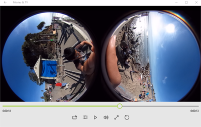
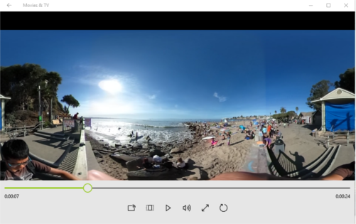
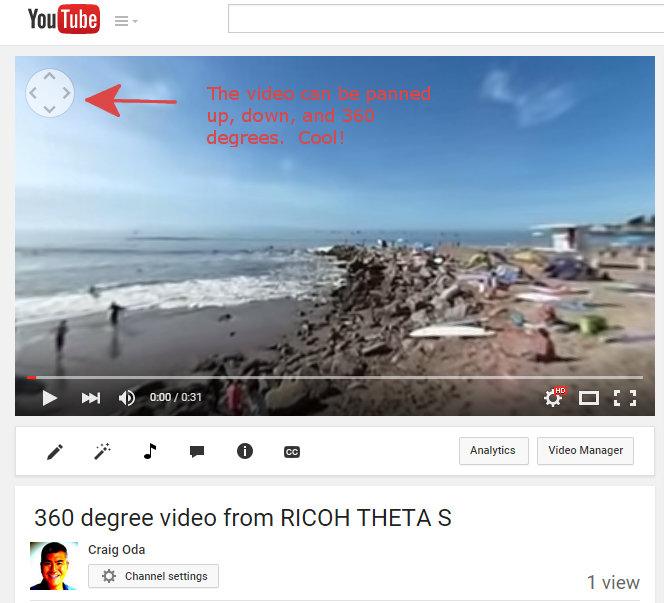

== Video Conversion From Dual Fish-Eye to Equirectangular

At the Hackathon, the camera is pre-production and the software is
not finished.  Thank you for being a pioneer.

The video output is in dual fish-eye mode.  In order to view this or
upload it to YouTube, you'll need to convert it to
equirectangular.  Sorry, but we do not have example code or a
public application to do this.  `:-(`

The RICOH table will have an application for conversion.  You can
bring a thumbdrive over to get your video converted.

By default, the program will take your file name and add `_er` to it.
The file is saved in the same location that the original video file was in.

Both the input and output are `.mp4` format videos.

The Dualfish Blender program will convert it to equirectangular.

You can now load the video up to YouTube to your normal channel.  YouTube
will grab the meta data and add the 360 degree video controls automatically.
This is cool!

https://youtu.be/MXX_JjQdtmE[Try it out].

NOTE: I've only tested the YouTube viewer on Windows, not on Linux.
